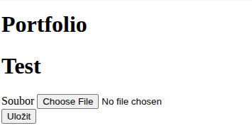
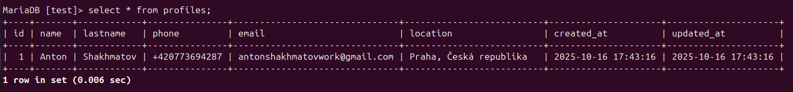
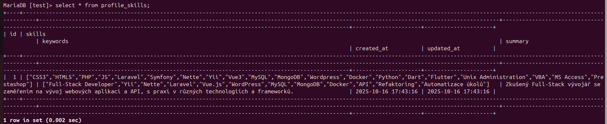

# Technologický stack
Nette (PHP framework), Python, Gemini (Prompt, čtení PDF/DOC), Selenium, BeautifulSoup, Docker, embedding

# Rychlý start (Docker)
Předpoklady

Docker + Docker Compose

Vyplněné klíče v konfiguraci (API klíče a přístupy k DB v local.neon / env)

Sestavení a spuštění

sudo docker compose build
sudo docker compose up -d

Spuštění automatického rozesílání:
sudo docker compose up -d   # (ještě jednou)

Otevřete aplikaci:
→ http://localhost

Kontrola Selenium:
sudo docker compose exec app curl -s http://selenium:4444/status

Práva pro logy/cache (lokálně i na hostingu)
sudo chmod -R 0777 ./log ./temp ./www

# Hlavní scénář použití
1. Otevřete http://localhost
2. Nahrajte CV přes formulář (upload).

Data z CV se uloží do databáze.

Tabulka profiles:

Tabulka profile_skills:

Při běhu projektu v Dockeru se parsování a auto-vyplňování spouští automaticky pomocí cronu uvnitř kontejnerů.
Cron běží na pozadí, není potřeba nic spouštět ručně.

Zpracované nabídky se ukládají do DB jako hash, aby nedocházelo k opakovanému odesílání:

Tabulka applied_jobs:

Na základě dat probíhá rozesílka:

# Individuální zpracování (kontejner embeddings)

Chcete ručně zpracovat konkrétní web/úlohu?
docker exec -it portfolio-embeddings-1 sh

Vyberte požadovaný web/úlohu a spusťte stejnojmenný .py soubor, např.:
python mysite.py

Názvy souborů odpovídají webům/procesům (např. example_com.py apod.).

# Užitečné příkazy

Zastavení:
sudo docker compose down

Přebudování a restart po změnách:
sudo docker compose build
sudo docker compose up -d

Logy hlavní aplikace:
sudo docker compose logs -f app

Logy cronu / parsování (pokud je v samostatné službě):
sudo docker compose logs -f parser
# nebo
sudo docker compose logs -f embeddings

Vstup do hlavního PHP kontejneru:
sudo docker compose exec app sh

# Databáze

Připojení se nastavuje v local.neon / proměnných prostředí (doctrine/dbal, database.dsn atd.).
Po startu kontejnerů ověřte, že je DB dostupná a (případné) migrace jsou aplikovány.

# Konfigurace

API klíče a další parametry se zadávají v local.neon (nebo v env proměnných).
Nekomitujte reálné klíče do repozitáře.

# Technická kontrola
Aplikace: http://localhost

Stav Selenium:
sudo docker compose exec app curl -s http://selenium:4444/status

Práva na adresáře:
sudo chmod -R 0777 ./log ./temp ./www

# Řešení problémů (Troubleshooting)

403/500 / „nelze zapisovat do temp“ → zkontrolujte práva na ./log, ./temp, ./www.

Cron „nefunguje“ → ujistěte se, že kontejnery běží (up -d), podívejte se do logů parser/embeddings.

Po nahrání CV nejsou data → zkontrolujte logy app, připojení k DB a správnost parseru.

Selenium neodpovídá → přestavte kontejnery, zkontrolujte Docker síť a stav přes URL výše.

# Nasazení na hosting / lokální server bez Dockeru

Nakonfigurujte PHP + webový server (Apache/Nginx) a DB.

Nainstalujte závislosti (composer install).

Zadejte přístupy a klíče v local.neon/env.

Udělte práva:
sudo chmod -R 0777 ./log ./temp ./www

Nastavte systémový cron (nebo Supervisor) pro spouštění parsování/úloh dle plánu.

--------------------------------------------------------------------------------------------------

# Технологический стек:
Nette(php framework), Python, Gemini(Prompt, pdf/doc reader), Selenium, BeautifulSoup, Docker, embedding

# Быстрый старт (Docker)
Предварительные требования

Docker + Docker Compose

Заполненные ключи в конфигурации (API-ключи и доступы к БД в local.neon/env)

Сборка и запуск

sudo docker compose build
sudo docker compose up -d

Запуск автоматиеской рассылки:
sudo docker compose up -d (ещё раз)

Откройте приложение:
→ http://localhost

sudo docker compose exec app curl -s http://selenium:4444/status

Права для логов/кэша (нужно и локально, и на хостинге)
sudo chmod -R 0777 ./log ./temp ./www

# Основной сценарий использования

Зайдите на http://localhost

Загрузите резюме через форму (upload).

Данные из резюме будут сохранены в базу данных.

до таблицы profiles:

до таблицы profile_skills:

При запущенном проекте в Docker, парсинг и автозаполнение запускаются автоматически по крону внутри контейнеров.

Крон работает в фоне, вручную ничего запускать не нужно.

Обработанные вакансии добавляются в базу данных в хэш формате, чтобы повторной отправки не происходило:

до таблицы applied_jobs:

На основе данных, происходит рассылка:

# Индивидуальная обработка (embeddings контейнер)

Если хотите вручную обработать конкретный сайт/задачу:

docker exec -it portfolio-embeddings-1 sh

выберите нужный сайт/задачу и запустите одноимённый .py файл, например:
python mysite.py

Имена файлов соответствуют сайтам/процессам (например, example_com.py и т.п.).

# Полезные команды

Остановить:
sudo docker compose down

Пересобрать и перезапустить после изменений:
sudo docker compose build
sudo docker compose up -d

Логи основного приложения:
sudo docker compose logs -f app

Логи cron/парсинга (если в отдельном сервисе):
sudo docker compose logs -f parser
или
sudo docker compose logs -f embeddings

Войти в основной контейнер PHP:
sudo docker compose exec app sh

# База данных

Подключение настраивается в local.neon / переменных окружения (doctrine/dbal / database.dsn и т.д.).

После старта контейнеров проверьте, что БД доступна и миграции (если есть) применены.

# Конфигурация

API-ключи и прочие параметры задаются в local.neon (или в переменных окружения).
Не коммитьте реальные ключи в репозиторий.

# Техническая проверка

Приложение: http://localhost
Selenium статус:
sudo docker compose exec app curl -s http://selenium:4444/status

Права на каталоги:
sudo chmod -R 0777 ./log ./temp ./www

# Траблшутинг

403/500/“темп не пишется” → проверьте права на ./log, ./temp, ./www.

Крон “не работает” → убедитесь, что контейнеры запущены (up -d), посмотрите логи parser/embeddings.

Нет данных после загрузки резюме → проверьте логи app, подключение к БД и корректность парсера.

Selenium не отвечает → пересоберите контейнеры, проверьте сеть docker и статус по URL выше.

# Деплой на хостинге/локальном сервере без Docker

Настройте PHP + веб-сервер (Apache/Nginx) и БД.

Установите зависимости (composer install).

Пропишите доступы и ключи в local.neon/env.

Выдайте права:
sudo chmod -R 0777 ./log ./temp ./www

Настройте системный cron (или Supervisor) для запуска парсинга/задач по расписанию.